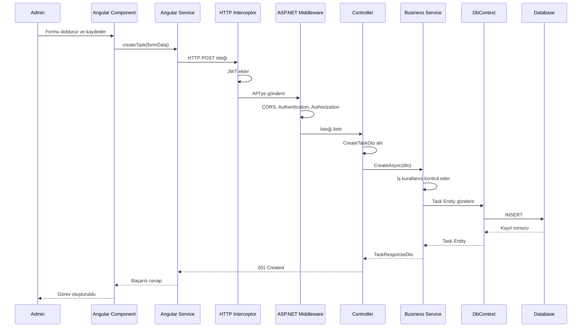

# Katmanlar ve İstek Akışı

Bu belge, projenin katmanlarının ne işe yaradığını ve birbirleriyle nasıl haberleştiğini açıklar.

## 1. Genel Mimari

```text
Angular Frontend
    |
    | HTTP / JSON
    v
ASP.NET Core API
    |
    +--> Middleware
    |
    +--> Controller
              |
              +--> DTO
              |
              +--> Business / Service
                        |
                        +--> Entity
                        |
                        +--> DbContext
                                  |
                                  v
                              Database
```

İstek genellikle yukarıdan aşağıya ilerler. Cevap aşağıdan yukarıya döner.

## 2. Katmanların Kısa Görevi

| Katman | Temel görevi |
|---|---|
| Angular Component | Kullanıcı ekranını ve etkileşimini yönetir |
| Angular Service | API'ye HTTP isteği gönderir |
| HTTP Interceptor | İsteklere JWT token ekler |
| Middleware | Ortak kontrolleri merkezi olarak yapar |
| Controller | HTTP isteğini karşılar ve cevap döndürür |
| DTO | API'ye giren/çıkan verinin şeklini belirler |
| Business / Service | İş kurallarını uygular |
| Entity | Veritabanındaki varlığı temsil eder |
| DbContext | C# ile veritabanı arasında bağlantı kurar |
| Database | Veriyi kalıcı olarak saklar |

## 3. Angular Component

Kullanıcının gördüğü ekranın kodudur.

Örneğin Admin görev formu:

```text
- Başlık alanını gösterir
- Açıklama alanını gösterir
- Stajyer seçtirir
- Kaydet butonunu yönetir
```

Component doğrudan SQL veya backend iş kuralı yazmaz. API çağrısı için Angular Service'i çağırır.

```text
Kullanıcı butona basar
    -> Component
    -> Angular Service
```

## 4. Angular Service

Frontend ile backend arasında HTTP haberleşmesini yapar.

Örneğin:

```text
POST /api/admin/tasks
GET  /api/tasks/my
```

Angular Service'in işi:

- API adresini kullanmak
- JSON göndermek
- JSON cevabı almak
- Component'e sonucu bildirmek

İş kuralları burada bulunmaz. Örneğin “Admin görev oluşturabilir mi?” kararı backend'deki yetki ve business katmanında kontrol edilir.

## 5. HTTP Interceptor

Angular'dan çıkan HTTP isteklerinin arasına girer.

```text
Angular Service isteği
    -> Interceptor
    -> API
```

Görevi:

- JWT access token'ı isteğe eklemek
- 401 cevabında login sayfasına yönlendirmek
- Ortak HTTP işlemlerini yapmak

Örnek HTTP başlığı:

```http
Authorization: Bearer <token>
```

Interceptor güvenliğin tamamını sağlamaz. Backend yine token ve rol kontrolü yapmalıdır.

## 6. Middleware

Backend'e gelen istek ile Controller arasındaki ortak kontrol katmanıdır.

```text
İstek
    -> Middleware pipeline
    -> Controller
```

Middleware örnekleri:

- CORS kontrolü
- JWT Authentication
- Authorization
- Merkezi hata yönetimi
- Logging
- HTTPS yönlendirmesi

Middleware bütün endpoint'lerde ortak çalışabilecek işlemler içindir.

“Stajyer sadece kendi görevini değiştirebilir” gibi projeye özel kural middleware'e değil, Business/Service katmanına aittir.

### Middleware ile Service farkı

```text
Middleware:
- Genel ve ortak kontroller
- Hata, log, token, CORS

Business Service:
- Projeye özel iş kuralları
- Görev atama
- Kullanıcı onaylama
- Sahiplik kontrolü
```

## 7. Controller

Controller, HTTP endpoint'lerinin bulunduğu katmandır.

Örnek:

```text
POST /api/admin/tasks
```

Bu istek `AdminTasksController` içindeki bir metoda gidebilir.

Controller'ın görevleri:

1. HTTP isteğini almak.
2. Request DTO'yu kabul etmek.
3. Gerekirse route parametresini almak.
4. Business Service'i çağırmak.
5. HTTP durum kodu döndürmek.
6. Response DTO döndürmek.

Controller'ın içine uzun iş kuralları veya SQL sorguları yazılmaz.

Örnek basit akış:

```csharp
public async Task<ActionResult<TaskResponseDto>> Create(CreateTaskDto dto)
{
    var task = await taskService.CreateAsync(dto);
    return CreatedAtAction(nameof(GetById), new { id = task.Id }, task);
}
```

Burada Controller:

- `CreateTaskDto` alır.
- `taskService` çağırır.
- `201 Created` ve sonuç verisini döndürür.

## 8. DTO

DTO, `Data Transfer Object` anlamına gelir.

API ile frontend arasında taşınan verinin özel modelidir.

### Request DTO

Frontend'den backend'e gelen veri:

```csharp
public class CreateTaskDto
{
    public string Title { get; set; } = string.Empty;
    public string Description { get; set; } = string.Empty;
    public int AssignedUserId { get; set; }
}
```

### Response DTO

Backend'den frontend'e dönen veri:

```csharp
public class TaskResponseDto
{
    public int Id { get; set; }
    public string Title { get; set; } = string.Empty;
    public string Status { get; set; } = string.Empty;
}
```

DTO'nun faydaları:

- `PasswordHash` gibi hassas alanların dışarı çıkmasını engeller.
- Kullanıcının değiştirebileceği alanları sınırlar.
- Gelen veriyi doğrulamayı kolaylaştırır.
- Entity ile API sözleşmesini birbirinden ayırır.

## 9. Business / Service Katmanı

Uygulamanın asıl kararları burada bulunur.

Örnek görev oluşturma kontrolleri:

```text
- Başlık boş mu?
- Atanacak kullanıcı var mı?
- Kullanıcı Intern rolünde mi?
- Kullanıcı Active durumda mı?
- Son tarih geçerli mi?
```

Örnek görev güncelleme kontrolleri:

```text
- Görev var mı?
- Giriş yapan kullanıcı görevin sahibi mi?
- Yeni durum geçerli mi?
- Kullanıcı bu alanı değiştirmeye yetkili mi?
```

Service, başarılı olursa DbContext üzerinden veritabanına gider.

## 10. Entity

Entity, veritabanındaki bir varlığı temsil eden C# sınıfıdır.

Projemizde:

```text
User             -> Users tablosu
Task             -> Tasks tablosu
InternshipNote   -> InternshipNotes tablosu
```

Entity veritabanı yapısını ve ilişkileri temsil eder.

```csharp
public class Task
{
    public int Id { get; set; }
    public string Title { get; set; } = string.Empty;
    public int AssignedUserId { get; set; }
    public User AssignedUser { get; set; } = null!;
}
```

Entity'yi doğrudan frontend'e döndürmek yerine Response DTO kullanırız.

## 11. DbContext

`DbContext`, Entity Framework Core ile C# kodu ve veritabanı arasındaki bağlantıdır.

Görevleri:

- Hangi entity'lerin tablo olduğunu tanımlamak
- İlişkileri yapılandırmak
- Sorgu yapmak
- Kayıt eklemek
- Güncellemek
- Silmek
- Değişiklikleri veritabanına kaydetmek

Basit akış:

```text
Service
    -> DbContext.Tasks.Add(task)
    -> SaveChangesAsync()
    -> SQL INSERT
```

## 12. Database

Verilerin kalıcı olarak saklandığı yerdir.

Projemizde tutulacak bilgiler:

```text
Users
Tasks
InternshipNotes
```

Database kendi başına business kararı vermez. Uygulama, DbContext aracılığıyla database'e erişir.

## 13. Tam İstek Akışı: Admin Görev Oluşturuyor

```text
1. Admin Angular'da formu doldurur.
2. Angular Component form verisini alır.
3. Angular Service POST isteği oluşturur.
4. HTTP Interceptor JWT token ekler.
5. Tarayıcı CORS kuralını uygular.
6. API Middleware token ve ortak kontrolleri yapar.
7. Controller isteği ve CreateTaskDto'yu alır.
8. Controller Business Service'i çağırır.
9. Business Service görev kurallarını kontrol eder.
10. Service yeni Task Entity oluşturur.
11. DbContext entity'yi database'e kaydeder.
12. Database kayıt sonucunu döndürür.
13. Service Response DTO oluşturur.
14. Controller 201 Created döndürür.
15. Angular Service cevabı alır.
16. Component görev listesini yeniler.
```

## 14. Şema



## 15. Cevap Akışı

İstek aşağı doğru iner:

```text
Angular -> Middleware -> Controller -> Service -> DbContext -> Database
```

Cevap yukarı doğru çıkar:

```text
Database -> DbContext -> Service -> Controller -> Angular
```

Her katman yalnızca kendi sorumluluğundaki işi yapar. Controller SQL yazmaz; Component veritabanına bağlanmaz; DTO veritabanı tablosu değildir.
